:::intro
[The Design Portfolio Workflow](https://medium.com/@katfukui/the-design-portfolio-workflow-a94030d0b39e#.uut2a0ulw) de @katmeister, s'adresse aux webdesigners curieux de se frotter un peu à la ligne de commande et à Jekyll. Nous espérons qu'il vous permettra de faire vos premiers pas avec Jekyll, d’apprécier la liberté et la souplesse qu'il procure et qui sait de pouvoir ensuite [développer des thèmes pour Jekyll](page:post/creer-un-theme-pour-jekyll) 😊
:::

## Un guide complet pour coder et déployer un site, tout en ligne de commande

Donc j'étais en train de mettre à jour mon [portfolio](http://www.katfukui.com/), j'éditais quelques liens dans le pied de page sur toutes les pages et j'ai pensé… putain mais que suis-je en train de faire de ma vie ? N'y aurait-il pas un moyen plus intelligent de faire ? J'étais dans l’expectative quand [James](https://medium.com/u/57b87df79e32) m'a suggéré de tester [Jekyll](https://jekyllrb.com/). Mon épopée commence donc ici.

Je partage ce guide pas-à-pas, car je pense que ce workflow pour un portfolio peut avoir de la valeur aux yeux de ceux qui souhaitent bénéficier de méthodes d’ingénierie robustes et éprouvées sans renoncer à leur amour du détail dans le design. Les designers aiment les systèmes clairs et les choses propres, donc pourquoi ne pas appliquer aussi cela à notre code ?

J'espère aussi que cet article montre aux designers curieux du code que ce n'est pas la peine d’avoir peur des outils modernes de développement web. Ça vous branche ? Allez, c'est parti !


## C’est quoi Jekyll ?

Jekyll est un "générateur de site, simple et paré pour le blog", ce qui signifie que vous créez des contenus dynamiques et des modèles sur votre ordinateur en local, puis Jekyll recrache le tout en fichiers statiques HTML et CSS que vous pouvez déposer sur votre site hébergé. Chaque entrée de portfolio est traitée comme un article de blog et est extrêmement simple à créer et à éditer. Jekyll inclus également un serveur web de test et supporte Sass.


Rapide ✔ Propre ✔ Simple ✔ Complet ✔

OK, tu m’intéresses.

## Développons un portfolio !

C’est assez fascinant pour vous ? Développons et déployons un site ensemble pour faire une démonstration du processus de travail. Premièrement, nous allons lancer le terminal et travailler avec la ligne de commande.

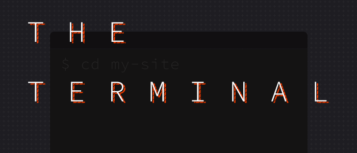

Même si vous n'avez pas beaucoup l’habitude de taper des commandes, vous vous en sortirez en connaissant les bases, comme se déplacer dans les dossiers de votre répertoire de travail. Vous pouvez apprendre les bases [ici](http://klare.io/terminal-commands.html) ou [ici](http://www.iamtomnewton.com/blog/designers-guide-command-line/). Sinon, le copier-coller n'est pas une si mauvaise chose pour commencer à apprendre.

Installons Jekyll[^1] ! Dans le terminal, j'ai tapé :

```sh
gem install jekyll bundler
```

Par défaut, le terminal s'ouvre dans votre dossier utilisateur. Vous pouvez voir les fichiers et les dossiers du répertoire courant en entrant `ls`. Ça me va très bien de créer mon nouveau portfolio à cet endroit, donc je vais taper :

```sh
jekyll new mon-site
cd mon-site
jekyll serve
```

Excellent ! J'ai donc maintenant un dossier sur mon ordinateur nommé `mon-site`.  
La commande `jekyll serve` lance un serveur web local pour prévisualiser votre site à l’adresse [http://localhost:4000](http://localhost:4000). Je vais garder cet onglet ouvert dans mon navigateur.

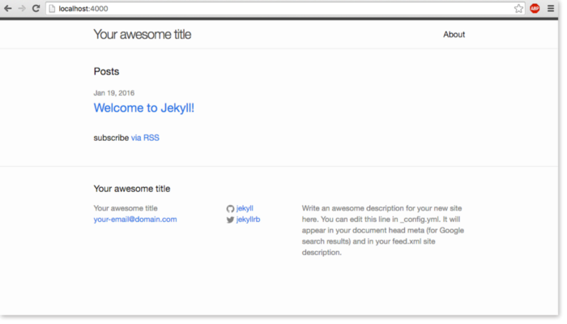

## Plongeons dans les fichiers

Regardons à quoi ressemble l’arborescence de notre site Jekyll en ouvrant le dossier `mon-site` dans notre éditeur de texte préféré. J'ai utilisé Sublime Text pendant des années mais récemment je suis passé à [Atom](https://atom.io/).  
C’est bien documenté et les paquets de la communauté sont assez mortels - [pigments](https://atom.io/packages/pigments), [Emmet](https://atom.io/packages/emmet) et [bezier-curve-editor](https://atom.io/packages/bezier-curve-editor) pour n'en citer que quelques-uns.

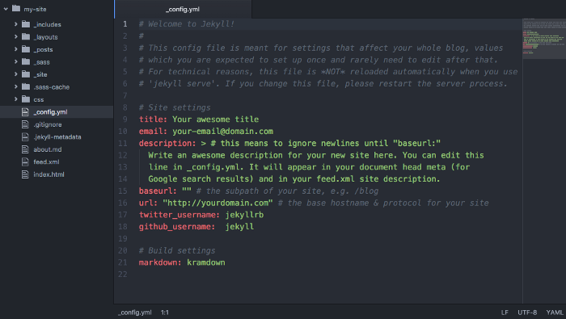

Pour ce guide, je vais utiliser [Atom](https://atom.io/). Vous remarquerez le panneau avec l’arborescence de fichier sur la gauche. Laissez-moi vous la détailler :

```sh
mon-site/
|
|-- _config.yml    # Configuration de votre site
|-- _drafts/       # Articles non publiés
|-- _includes/     # Composants HTML réutilisables
|-- _layouts/      # Modèles
|-- _posts/        # Articles (ou entrées de portfolio !)
|-- _sass/         # Fichiers Sass
|-- _site/         # Votre site généré
|-- css/           # fichier CSS principal
|-- about.md       # Page à propos
|-- index.html     # index du site
```

C’est l’arborescence par défaut. Tout dossier dont le nom commence par un tiret bas `_` ne sera pas généré tel quel. Par exemple quand Jekyll va générer votre site, il ne va pas créer un dossier `layouts`, par contre il générera le fichier `index.html` puisqu'il n'y a pas de tiret bas devant.

Vous pouvez ajouter autant de dossiers que vous voulez pour organiser vos icônes, vos vignettes, vos fichiers JavaScript, etc. Ils seront copiés dans le site généré tels quels. Organisez-vous comme bon vous semble, voici quelques exemples de dossiers :

```sh
assets/        # images du projet
images/        # fichiers SVG, images diverses
js/            # fichiers Javascript, les vôtres et ceux des différentes bibliothèques utilisées.
```

## Modifier les paramètres de votre site

Jekyll inclus ce super fichier nommé `_config.yml` dans le répertoire racine. Vous pouvez définir [n'importe quel paramètre](http://jekyllrb.com/docs/configuration/) global de votre portfolio dedans. Ouvrons-le et personnalisons tout ça !

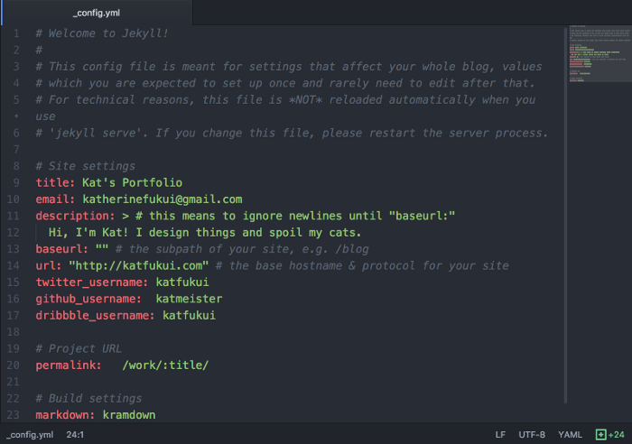

J'ai ajouté un paramètre _permalink_ pour définir comment je voulais construire les URLs du site (sinon par défaut la date de l’article est présente). J'ai aussi ajouté une variable `dribbble_username`.

À chaque fois que nous allons modifier `_config.yml`, il nous faudra relancer le serveur de Jekyll. Donc une fois les changements effectués, arrêtez le serveur en ligne de commande avec le raccourci `ctrl-c`. Entez à nouveau `jekyll serve` et jetez un coup d’œil à localhost !

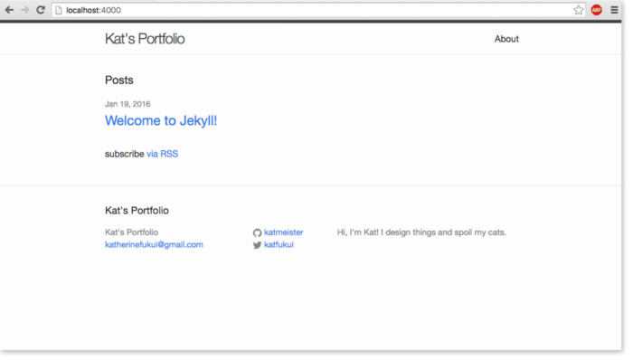

Cette flexibilité c'est ce qui rend Jekyll si fun et simple à mettre en œuvre.  
Voyons comment ce concept est aussi valable pour nos articles.

## Ajoutons notre premier article !

À quoi sert un portfolio sans démonstration de notre travail ? Écrivons un article à propos de mon _side-projet_ d’application de livraison de nourriture pour chat, _Food Right Meow_. Dans le dossier `_posts`, je vais créer un nouveau fichier Markdown en utilisant la convention `ANNEE-MOIS-JOUR-titre`[^2]. Le fichier de mon article est donc nommé `2016-11-10-livraison-nourriture-chats.markdown`.

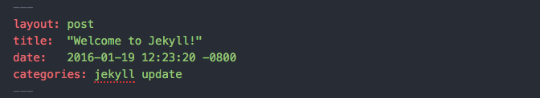

Vous remarquerez une portion de contenu en haut de l’introduction de l’article sur Jekyll. Copions-la dans notre nouvel article et voyons ensemble ses pouvoirs extraordinaires.

## YAML front matter

Front matter est un puissant outil qui permet de définir des variables spécifiques à une page. Ces variables sont accessibles de partout grâce aux balises Liquid, que nous allons voir très bientôt

Éditons notre front matter en haut de l’article entre les triples tirets :

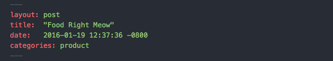

Jekyll possède quelques variables front matter prédéfinies, mais c'est en créant vos propres variables dans vos modèles que vous en tirerez le plus parti ! Regardons comment notre premier article utilise les variables front matter :

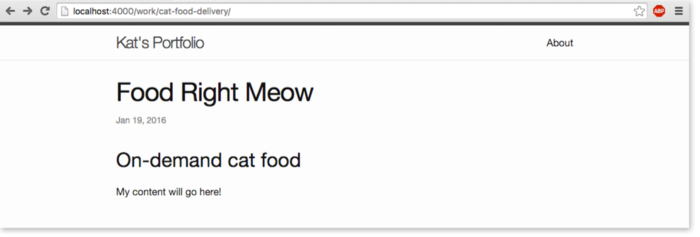

## Liquid

Alors comment ça marche tout ça ? Ces variables front matter sont référencées dans le HTML et le Markdown grâce à [Liquid](http://shopify.github.io/liquid/), un langage de modélisation très facile à prendre en main. Liquid vous permet d’ajouter de la logique, comme des conditions `if/else` et des boucles `for`, d’assigner des chaines de caractères à des variables. Les trucs entre `{{ }}` ou `` c'est pour faire bosser Liquid !

Si vous ouvrez le fichier `post.html` dans le dossier `_layouts`, nous pouvons le voir en action.

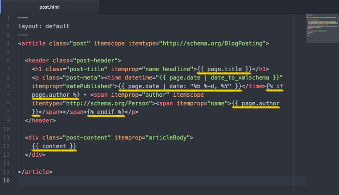

En préfixant nos variables avec `page`, Liquid va rechercher dans votre page les entrées front matter correspondantes entre les triples tirets. Si elles existent, nous pouvons écrire le texte stocké dans ces variables dans notre HTML. Cool, non ?  
[Plus de détails sur les variables par ici](https://jekyllrb.com/docs/variables/).

Et si nous ajoutons encore quelques variables à nous dans le front matter pour épicer un peu nos articles :

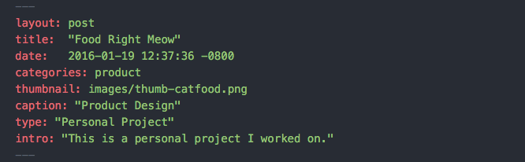

Maintenant que nous disposons de toutes ces super variables, comment pouvons-nous les utiliser ? Modifions notre modèle de mise en page `post.html` en utilisant les variables `page.type` et `page.intro` :

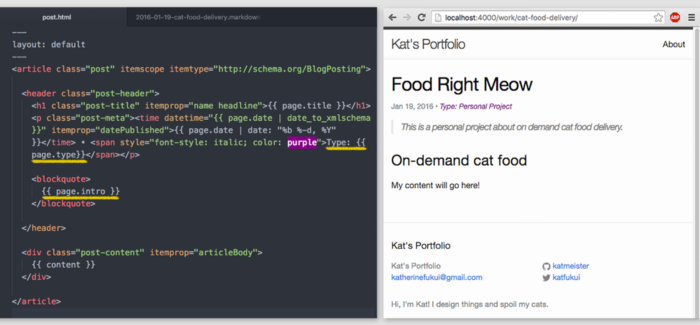

Cool ! Vous pouvez bien entendu utiliser CSS comme à votre habitude pour mettre en forme tous les rendus de vos chouettes balises. Essayons d’autres trucs. Et si nous ajoutions des vignettes pour chaque article sur la page `index.html` ?  
Et leur légende aussi peut-être.

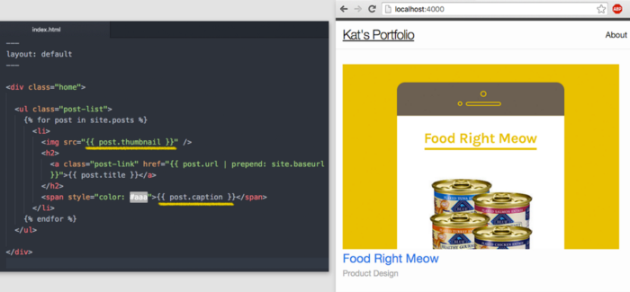

Hé, c'est pas trop mal. Je suis sûr que vous pouvez déjà voir comment Jekyll va automatiser votre site en utilisant Liquid et YAML.

## Écrire un article pour de vrai

Vous aurez noté l’extension `.md` ou `.markdown` pour vos articles. C’est l’abréviation pour Markdown, un langage léger qui convertit sans heurt du texte brut en HTML. Je me suis rendu-compte qu'écrire à l’aide de la syntaxe Markdown me permet de mieux me concentrer sur mon contenu, plutôt que de penser quelles balises fermer.

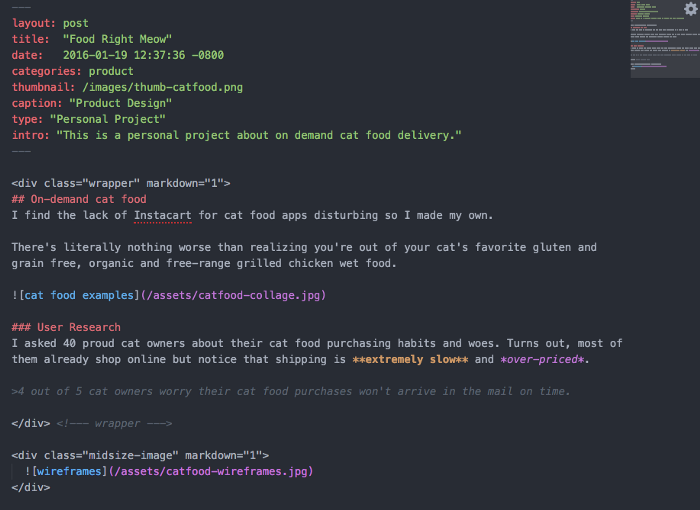

La beauté de Markdown c'est que vous pouvez toujours utiliser HTML si vous en avez besoin. Pour forcer le rendu de Markdown à l’intérieur de balises HTML, ajoutez `markdown=1` et le tour est joué ! Le meilleur des deux mondes. Voici un extrait de l’article une fois généré :

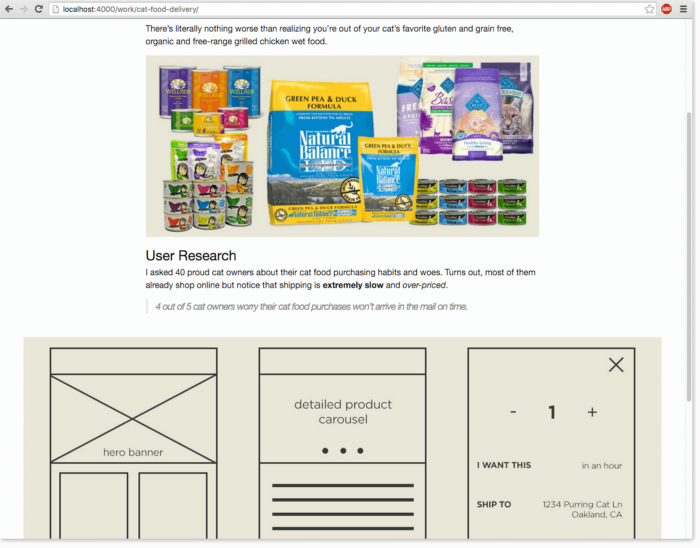

## Un autre exemple d’article en .md

Lorsque j'ai migré les vieux projets de mon portfolio dans Jekyll, j'ai trouvé que mélanger le HTML et Markdown c'était trop bizarre et que ça allait à l’encontre de l’objectif de clarté de Markdown. j’ai créé [une démo](http://katfukui.com/clean-posts-jekyll/) qui montre ce que j'ai fait pour parvenir à des articles plus propres tout en gardant les styles désirés !  
Ce n'est en aucun cas une obligation ou la bonne manière de faire — juste une technique pour satisfaire mon côté hyper-maniaque. 😊 Vous êtes libres de télécharger et de vous amuser avec les [fichiers sur Github](https://github.com/katmeister/clean-posts-jekyll).

## Ajoutons un peu de CSS à tout ça

Maintenant que nous nous sommes familiarisés avec les possibilités de Jekyll et que nous avons un peu de contenu avec lequel travailler, ajoutons un peu de style ! Vous pouvez recopier le CSS ou le Sass de votre portfolio existant ou repartir de zéro.

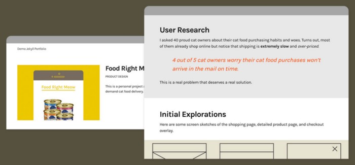

## Sass

Vous avez probablement remarqué que les projets Jekyll sont livrés avec des fichiers Sass (avec une extension `.scss`). Bien que vous n'ayez pas besoin de connaître [Sass](https://sass-lang.com/) pour pouvoir utiliser Jekyll, c'est un outil apprécié et recommandé dans le processus de développement CSS. Sérieusement, votre CSS sera bien mieux organisé et cohérent une fois que vous l’aurez adopté.  
Ces [guides pour débutant](http://thesassway.com/beginner) m'ont beaucoup aidé quand j'ai commencé. Jekyll intègre par défaut le support de Sass, vous n'avez donc pas d’excuse pour l’adopter. 😉

## Versionnement avec Git

Maintenant que vous vous êtes accommodés du terminal, je vous recommande vivement d’utiliser Git pour versionner votre portfolio. Git prend des "clichés" de votre **dépôt** — le répertoire du projet — à chaque fois que vous faites un **commit**, de façon à ce que vous puissiez revenir à des versions antérieures de votre travail quand c'est nécessaire. Si vous travaillez avec une autre personne, vous pouvez travailler chacun sur votre propre **branche** du projet et **fusionner** ensuite tout ça dans la branche **master**, visible de tous les intervenants du projet.

## Configurer Git

[Téléchargez et installez Git](https://git-scm.com/downloads). De retour dans votre terminal, entrez ces commandes (et ajoutez vos propres infos entre les guillemets) :

```sh
git config --global user.name “Votre Nom”
git config --global user.email "[adresse mail]"
```

Super, nous sommes parés pour Git ! Mais notre projet ne pourra pas utiliser Git tant que nous ne l’aurons pas initialisé. Dans le répertoire `mon-site`, je vais donc taper :

```sh
git init
```

Facile ! Notre nouveau dépôt Git est vide, ajoutons-y donc nos fichiers.

```sh
git add .
```

Super, notre projet est ajouté au dépôt local et est prêt à être enregistré dans un commit. Prenons une photo de notre dépôt en faisant notre premier commit !  
Utilisez l’option `-m` suivi d’un message significatif entre guillemets.

```sh
git commit -m "Première entrée du portfolio"
```

Notre projet possède officiellement un historique ! Git fonctionne en local, mais GitHub est un service de stockage distant pour **pousser** nos dépôts sur le web et les partager avec le reste du monde. Connectons notre dépôt local à un dépôt distant sur GitHub et poussons notre premier commit.

## Créer un dépôt sur GitHub

Maintenant que nous avons initialisé Git pour notre portfolio, configurons un dépôt distant sur GitHub.

1. [Créez-vous un compte](https://github.com/join), si vous n'en possédez pas encore.
2. Créez un [nouveau dépôt](https://github.com/new).  

3. Donnez un nom et ajoutez une description à votre dépôt. Créez le dépôt !  
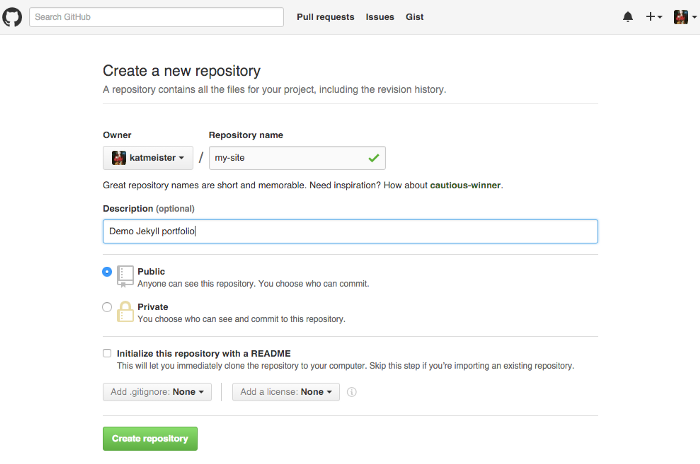
4. Maintenant que vous avez créé le dépôt, vous allez voir cette page s'afficher sur GitHub :  
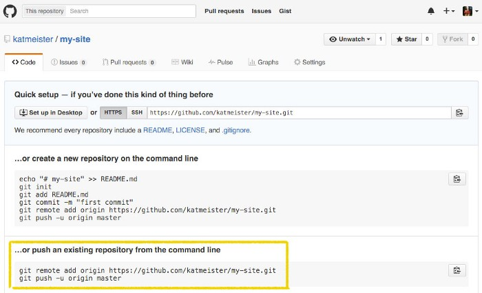
C’est la partie "publier un dépôt existant en ligne de commande" qui nous intéresse. Je vais copier-coller ces commandes dans le terminal.  
`git remote add origin` connecte les deux dépôts pour permettre le déploiement.  
`git push` pousse les commits locaux dans votre dépôt distant !
5. Actualisez la page de votre dépôt distant et félicitez-vous ! ON A RÉUSSI.  
Maintenant le monde entier peut admirer notre super portfolio !

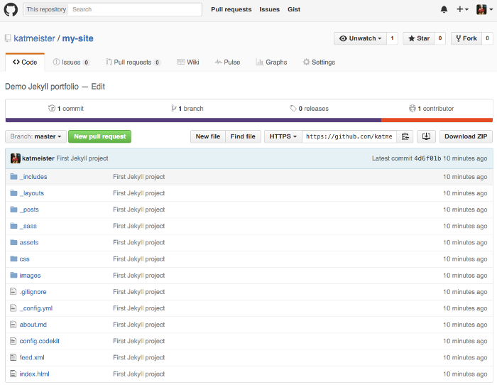

Voici un [guide pour débutant très sympa](http://readwrite.com/2013/09/30/understanding-github-a-journey-for-beginners-part-1) pour des explications plus détaillées.

## GitHub Pages

À partir de là, nous pouvons aller encore plus loin et configurer notre dépôt pour [GitHub Pages](https://pages.github.com/) — un hébergement gratuit sans FTP. Yep, ça veut dire que vous pouvez enregistrer et publier vos changements et voir immédiatement ces modifications en ligne !

C’est un écosystème complet, accessible depuis votre terminal de confiance.

## Mes conseils supplémentaires

Parce que ce guide n'est pas déjà assez long.

### Tester sur mobile

Le test sur mobile est inclus ! Autorisons Jekyll à accéder à notre mobile en lançant le serveur de cette manière dans le terminal :

```sh
jekyll serve --host 0.0.0.0
```

Ensuite, récupérez votre adresse IP sur le réseau Wi-Fi local et faites là pointer vers le port 4000. En gros, vous allez taper un truc comme **192.168.x.x:4000** dans votre navigateur mobile. Si vous voulez savoir comment ça marche, [lisez cet article](http://zarino.co.uk/post/jekyll-local-network/).

## Système de grille


Pour un portfolio, un système de grille léger est facile à implémenter et il ne se met pas en travers de votre CSS. J'utilise [Jeet](http://jeet.gs/) parce que j'aime sa syntaxe et sa souplesse. Ceci dit, il y en a des tonnes de super chouettes, comme [Neat](http://neat.bourbon.io/) ou [Toast](http://daneden.github.io/Toast/).

## Rythme vertical

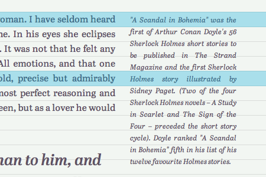

Le rythme vertical c'est l’espacement constant et la mise à l’échelle des paragraphes, des marges externes et internes, des tailles de police et des hauteurs de ligne. Trouver le bon rythme améliore la lisibilité et l’harmonie d’un site. J'utilise [modular-scale](https://github.com/modularscale/modularscale-sass) sur mon propre portfolio. Apprenez en davantage sur le rythme vertical
[ici](http://webdesign.tutsplus.com/articles/improving-layout-with-vertical-rhythm--webdesign-14070) ou [là](http://typecast.com/blog/4-simple-steps-to-vertical-rhythm).

## Fin

Et voilà comment on crée et on déploie un joli modèle de portfolio, entièrement à partir du terminal. Vous n'avez plus qu'à créer un simple article au format texte pour les nouveaux projets et à taper quelques commandes pour le publier sur GitHub Pages.

J'espère que vous avez aimé construire un portfolio pour _Food Right Meow_ avec moi. Créer et redesigner votre portfolio devrait être fun et enrichissant, alors à vos claviers et à vos lignes de commande !

### [Téléchargez ou forkez le dépôt de démo](https://github.com/katmeister/my-site)

### [Voir la démo en action](http://katfukui.com/my-site/)


[^1]: [Installez Ruby et Jekyll à l’aide d’Homebrew sous Mac](https://gist.github.com/DirtyF/5d2bde5c682101b7b5d90708ad333bf3){embed=false}.
[^2]: Le plugin [jekyll-atom](https://github.com/Arcath/jekyll-atom/) facilite la création de posts en respectant cette convention.
