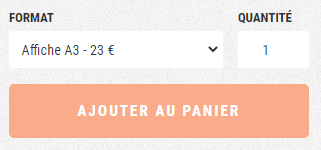
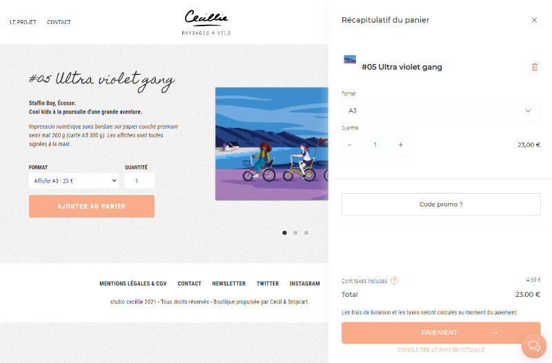

:::intro
Billet initialement publié sur le [blog d’Arnaud Ligny](https://arnaudligny.fr/blog/un-site-e-commerce-avec-cecil-et-snipcart/).
:::

En début d’année ma chérie terminait la [campagne Ulule de son projet ***Paysages à vélo***](https://fr.ulule.com/paysages-a-velo/) et se posait la question de continuer la vente de ses créations via une boutique en ligne.

Elle m’a alors sollicité pour l’aider à concevoir et construire cette boutique. Elle hésitait entre une solution clef en main telle que *Shopify* ou une solution basée sur un framework e-commerce tel *WooCommerce*.  
Néanmoins, la première solution reste onéreuse pour un petit projet (peu de ventes) et la seconde demande beaucoup d’énergie y compris pour un petit catalogue.

Je lui ai alors proposé de créer un site web statique avec [**Cecil**](https://cecil.app) auquel nous brancherions la solution e-commerce [**Snipcart**](https://snipcart.com) afin de dynamiser les interactions utilisateur.
<!-- break -->

[toc]

## Pourquoi un site statique ?

Je suis un fervent promoteur de l’approche statique pour la diffusion de sites web de contenu pour les raisons suivantes (entre autres) :

- **Performance** : une fois généré, le site n’a pas plus besoin d’être interprété par le serveur, juste d’être servi ;
- **Simplicité** : pas de base de données à maintenir car les données sont stockées dans des fichiers plats (Markdown + YAML) ;
- **Portabilité** : peut être hébergé sur n’importe serveur web et peut donc être migré facilement selon les besoins.

Dans le cas de ce projet j’ai donc utilisé [mon propre générateur de site statique](https://arnaudligny.fr/blog/cecil-mon-generateur-de-site-statique/) : [Cecil](https://cecil.app).

## Pourquoi Snipcart ?

[Snipcart](https://snipcart.com) n’est pas une solution e-commerce clef en main mais plutôt un « checkout » (tunnel d’achat) à ajouter à n’importe quel site web.

Il est donc nécessaire d’avoir préalablement créé un site catalogue pour charger les articles (produits) dans sa boutique Snipcart, puis de placer un bouton d’ajout au panier sur chaque fiche produit.

Le reste, à savoir le panier et les étapes de la commandes (saisie de l’adresse de facturation, choix du mode de livraison, paiement, etc.), est injecté automatiquement via JavaScript par le composant Snipcart.

Intérêt de cette approche et de Snipcart en particulier :

- **Indépendance** concernant la gestion du catalogue ;
- **Peu ou pas de développement** spécifique, principalement de la personnalisation ;
- **Tarif** honnête (2% des ventes) ;
- **Sécurisation** des transactions portée par la solution de paiement (ici [Stripe](https://stripe.com/fr)).

## Mise en œuvre

### Création du catalogue

Le catalogue de [Paysages à vélo](https://shop.cecillie.fr/) est très simple : il s’agit de proposer moins d’une dizaine d’affiches dans 2 formats d’impression (A3 et A5).  
En pratique nous avons 6 modèles composés d’1 variant « format ».

Les attributs et le texte de la fiche produit sont définis dans un fichier [Markdown](https://daringfireball.net/projects/markdown/) (avec un « [front matter](https://cecil.app/documentation/content/#front-matter) ») :

```
pages/products
|_ index.md
|_ 1.pink-gravel.md
|_ 2.purple-cargo.md
|_ 3.yellow-longtail.md
|_ 4.blue-folding-bike.md
|_ 5.ultra-violet-gang.md
|_ 6.lemon-lovers.md
```

Les produits partagent les mêmes caractéristiques de base, qui peuvent donc être mutualisées à la racine de la section *products* via le fichier `pages/products/index.md`.  
Les attributs sont définis via des variables au format [YAML](https://fr.m.wikipedia.org/wiki/YAML) :

```yaml
---
cascade:
  price: 23
  variants:
  - name: Format
    options:
    - value: A3
      html: "Affiche A3 - 23 €"
      price: 0
    - value: A5
      html: "Carte A5 - 8 €"
      price: -15
---
```

J’ai utilisé la variable spéciale [`cascade`](https://cecil.app/documentation/content/#cascade) qui permet de faire hériter à toutes pages de la section les variables qu’elle contient :

- `price` : le prix de référence
- `variants` : qui caractérise les déclinaisons pour chacun des produits, en l’occurrence le *format* d’impression
  - `options` :
    - `value` : la valeur du format (ex : « A3 »)
    - `html` : le texte affiché dans la liste déroulante
    - `price` : le prix modifié par rapport au prix de référence (qui peut être négatif)

Ensuite chacun des produits est caractérisé via son propre fichier Markdown, par exemple `pages/products/1.pink-gravel.md` :

```yaml
---
title: "Pink gravel"
description: "Femme ridant en toute liberté au pieds des montagnes."
name: "#01 Pink gravel"
image: "/images/products/01-Pink-gravel-A3_S.png"
gallery:
- "/images/products/01-Pink-gravel-A5_S.png"
- "/images/products/01-Pink-gravel-ZOOM_S.png"
published: true
---
**Gavarnie, Hautes-Pyrénées.**  
**Femme ridant en toute liberté au pieds des montagnes.**

_Impression numérique sans bordure sur papier couché premium semi mat 200 g (carte A5 300 g). 
Les affiches sont toutes signées à la main._
```

### Templates et intégration Snipcart

#### Liste des produits

La volumétrie du catalogue étant très faible il n’est pas nécessaire de construire une arborescence complexe : afficher l’ensemble des produits sur la page d’accueil est suffisant.

Ainsi le template [Twig](https://twig.symfony.com/) `layouts/index.html.twig` liste l’ensemble des « pages » contenus dans la section *products* triées par « poids » inverse (donc la dernière création en première position) :

```twig



<div class="hero">
  {{~ page.content ~}}
</div>
<div class="products">
  
    
  
</div>

```

#### Fiche produit

La fiche produit (un [composant Twig](https://github.com/cecillie/eshop/blob/main/layouts/components/product.html.twig) réutilisable) va afficher :

1. Les informations : nom, description, photos, etc.
2. Le choix du format (options du variant *format*), la saisie de la quantité souhaitée et le bouton « **Ajouter au panier** »

Concentrons nous sur le cœur de la fiche produit, à savoir l’ajout au panier :



```twig
<div class="product__details">
  
  <div>
    
      
    <label for="{{ productId }}-{{ variant.name|lower }}">{{ variant.name }}</label>
    <select id="{{ productId }}-{{ variant.name|lower }}" class="{{ variant.name|lower }}">
        
      <option value="{{ option.value }}">{{ option.html }}</option>
        
    </select>
      
    
  </div>
  
  <div>
    <label for="{{ productId }}-qty">Quantité</label>
    <input type="number" id="{{ productId }}-qty" class="qty" min="1" max="10" value="1" />
  </div>
  
</div>
```

Cette portion du template `layouts/components/product.html.twig` est composée de 3 parties :

1. La liste déroulantes des formats, en faisant une boucle sur l‘ensemble des variants disponibles (ici uniquement *format*), puis une autre boucle sur l’ensemble des options (*A3* et *A5*) ;
2. Le champ de saisi de la quantité ;
3. Le bouton d’ajout au panier (représenté par le composant `add-item.html.twig`).

C’est le composant bouton qui porte les attributs permettant l’ajout du produit au panier Snipcart.

#### Intégration Snipcart

L’intégration de Snipcart est simple, et nécessite :

1. La feuille de style de référence ;
2. Un ou plusieurs boutons d’ajout au panier, portant les attributs du produit : identifiant, URL, nom, prix, etc. ;
3. Une balise `<div>` invisible (permettant affichage du panier) portant la clef d’API Snipcart ;
4. L’applicatif à proprement parlé via un fichier JavaScript.

```html
<link rel="stylesheet" href="https://cdn.snipcart.com/themes/v3.0.11/default/snipcart.css" />

<button class="snipcart-add-item"
  data-item-id="product-1"
  data-item-url="/"
  data-item-name="Product #1"
  data-item-price="10.99"
>Add to cart</button>

<div hidden id="snipcart" data-api-key="MzMxN2Y0ODMtOWNhMy00YzUzLWFiNTYtZjMwZTRkZDcxYzM4"></div>

<script src="https://cdn.snipcart.com/themes/v3.0.11/default/snipcart.js"></script>
```

- Démo : <https://codepen.io/thatfrankdev/pen/xxwRXQw?editors=1000>
- Template de *Paysages à vélo* : [layouts/components/add-item.html.twig](https://github.com/cecillie/eshop/blob/main/layouts/components/add-item.html.twig)

### Personnalisation du tunnel d’achat

J’ai également pris le temps de personnaliser le tunnel d’achat à la fois au niveau du rendu graphique et des étapes.



#### Personnalisation du rendu

Concernant le rendu graphique, ce n’est pas le plus commode à réaliser : il est en effet nécessaire d’inspecter l’ensemble des composants HTML afin d’identifier les classes CSS, de les dupliquer et de les modifier selon ses besoins.

Par exemple, pour remplacer la police de caractère :

```css
.snipcart {
  font-family: 'Roboto Condensed', sans-serif;
}
```

La feuille de style Sass de *Paysages à vélo* disponible sur [GitHub](https://github.com/cecillie/eshop/blob/main/static/css/main.scss#L418).

> Remarque : depuis la version 3.2, Snipcart a introduit la notion de « [Theming](https://docs.snipcart.com/v3/setup/theming) » qui facilite grandement la personnalisation via des propriétés CSS.

#### Personnalisation des textes

Les textes de l’interface de Snipcart sont disponibles en français (à laquelle j’ai d’ailleurs apporté [ma contribution](https://github.com/snipcart/snipcart-l10n/blob/master/locales/fr-FR.json)) sans paramétrage particulier (autre qu’en définissant l’attribut `lang` de la balise `<html>`) mais si vous souhaitez personnaliser les textes, ça reste possible en chargeant son propre fichier de langue :

```javascript
document.addEventListener('snipcart.ready', function() {
  fetch('/snipcart/{{ language }}.json')
    .then(response => response.json())
    .then(translation => Snipcart.api.session.setLanguage('{{ language }}', translation))
});
```

#### Personnalisation des formulaires

Snipcart permet également de modifier et d’enrichir les étapes du tunnel d’achat via des [templates Vue.js](https://docs.snipcart.com/v3/setup/customization) :

```html
<div hidden id="snipcart" data-api-key="{{ site.snipcart.apikey }}" data-templates-url="/snipcart/templates.tpl"></div>
```

Ainsi, dans le cas de *Paysages à vélo* j’ai :

1. Modifié l’affichage des lignes du panier afin d’y indiquer le format d’impression sélectionné à côté du nom du produit ;
2. Désactivé la suggestion d’adresse (qui n’est pas très fiable sur le territoire français) ;
3. Ajouté un champ de saisi d’un message cadeau.

Par exemple, dans le cas du champ de saisi du message cadeau, le code ressemble à ça :

```html
<shipping-address section="bottom">
  <fieldset class="snipcart-form__set">
    <hr class="snipcart-form__separator" />
    <!-- Gift message -->
    <div class="snipcart-form__field">
      <snipcart-label class="snipcart__font--tiny" for="Message cadeau">Message cadeau</snipcart-label>
      <snipcart-input name="Message cadeau"></snipcart-input>
      <p class="snipcart__font--tiny snipcart-form__footer">
        (Votre message sera écrit à la main sur une carte, ajoutée au colis)
      </p>
    </div>
  </fieldset>
</shipping-address>
```

> Si vous voulez en voir plus le [code source est disponible sur GitHub](https://github.com/cecillie/eshop/blob/main/static/snipcart/templates.tpl).

## Gestion de contenu (CMS)

La configuration du site, les fiches produit et les pages de contenu sont administrables à la main en éditant les fichiers correspondant, ce qui est suffisant dans la plupart des cas.

Néanmoins il peut s’avérer plus commode et plus agréable de pouvoir s’appuyer sur un CMS : dans le cas de *Paysages à vélo*, j’ai retenu [**Forestry**](https://forestry.io) pour sa simplicité de mise en œuvre et d’utilisation.

De plus Forestry offre un fonctionnalité de prévisualisation, en contexte, très efficace !

<!--
<video controls preload="none" poster="/images/2021-06-24-un-site-e-commerce-avec-cecil-et-snipcart/forestry-preview-demo.mp4_poster.webp">
  <source src="/images/2021-06-24-un-site-e-commerce-avec-cecil-et-snipcart/forestry-preview-demo.webm" type="video/webm">
  <source src="/images/2021-06-24-un-site-e-commerce-avec-cecil-et-snipcart/forestry-preview-demo.mp4" type="video/mp4">
</video>
-->
[Démo Forestry](/images/2021-06-24-un-site-e-commerce-avec-cecil-et-snipcart/forestry-preview-demo.webm "Démo Forestry"){controls preload=none poster=/images/2021-06-24-un-site-e-commerce-avec-cecil-et-snipcart/forestry-preview-demo.mp4_poster.webp}

## Conclusion

J’ai pris beaucoup de plaisir à réaliser ce petit site e-commerce, principalement grâce à Snipcart qui m’a permis d’être libre sur la création du site web catalogue tout en offrant des options de personnalisation du tunnel d’achat relativement simples à mettre en œuvre (j’aurais d’ailleurs pu également parler de la possibilité de [personnaliser les frais de port via *webhook*](https://docs.snipcart.com/v3/webhooks/shipping)).

**Et surtout :** l’utilisatrice du site est autonome sur la gestion des contenus, la création de nouveaux produits et la gestion des commandes, ce qui est finalement le plus important pour la réussite d’un site e-commerce ! 🛒😊

Enfin, je vous invite à :

- Étudier le [code source du projet](https://github.com/cecillie/eshop) si vous souhaitez en savoir plus et vous inspirer ;
- Jeter un œil à mon générateur de site statique : [Cecil](https://cecil.app/) ;
- Consulter le site officiel de [Snipcart](https://snipcart.com/fr).
