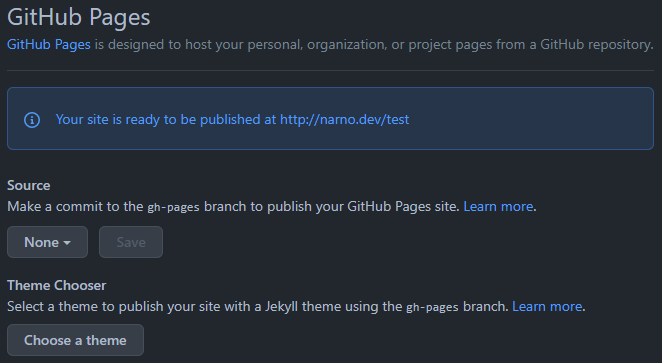

:::intro
Billet initialement publié sur le [blog d’Arnaud Ligny](https://arnaudligny.fr/blog/generer-et-heberger-un-site-statique-avec-github/).
:::

[GitHub](https://github.com) fourni l’outillage nécessaire pour générer un site statique et pour l’héberger – gratuitement – grâce à [GitHub Pages](https://pages.github.com/) et [GitHub Actions](https://github.com/features/actions).

Dans cet article j’explique comment mettre en pratique GitHub Pages et GitHub Actions, en utilisant [Cecil](https://cecil.app) comme générateur de site statique.

<!-- break -->

[toc]

## Qu’est-ce que GitHub Pages ?


[GitHub Pages](https://pages.github.com/) est une solution d’hébergement de pages web statiques permettant de créer rapidement un site web associé à un projet GitHub.\
Historiquement, cette branche dédiée d’un dépôt, utilise [Jekyll](https://jekyllrb.com/) par défaut pour générer à la volée des pages web à partir de son contenu (fichiers Markdown et HTML).

Aujourd’hui de nombreux développeurs ont abandonnés Jekyll au profit d’autres générateurs de site statique, plus riches en fonctionnalités, afin de profiter de cette solution d’hébergement gratuite.

GitHub Pages est très facile à utiliser, puisqu’il suffit de commiter des fichiers dans un dépôt GitHub pour obtenir un site web, mais reste limité et ne propose que les réglages suivants :

1. Choix de la branche (et du dossier : racine ou `/docs`) à utiliser
2. Possibilité de choisir un domaine personnalisé (via un enregistrement `CNAME`)
3. Activation de HTTPS

Comme je viens de l’indiquer, l’idée ici de s’appuyer sur le SSG de son choix : mais dans ce cas, comment automatiser la génération en cas de modification d’une page de contenu ou d’un template ? C’est là que GitHub Actions intervient  ! 😀

## Qu’est-ce que GitHub Actions ?


[GitHub Actions](https://github.com/features/actions) est la solution de GitHub pour automatiser des workflows de type intégration ou déploiement continue.

Le principe est très proche de ce que propose des outils comme [Jenkins](https://www.jenkins.io/), [Travis CI](https://www.travis-ci.com/) ou encore [GitLab CI](https://about.gitlab.com/stages-devops-lifecycle/continuous-integration/).

En pratique c’est plutôt simple : un fichier de configuration permet de déterminer quelles actions déclencher, selon quels évènements, dans un ou plusieurs environnements donnés, dans un certain ordre et de produire un « livrable » ou un résultat (positif ou négatif).

Ce qui fait la puissance de GitHub Actions c’est à la fois la rapidité de mise à disposition de ses machines virtuelles et surtout, comme son nom l’indique, de ses (très nombreuses) [**Actions** mis à disposition par la communauté sur la marketplace](https://github.com/marketplace?type=actions).

## En pratique, comment faire ?

Le principe semble simple mais, en pratique, est-ce que c’est aussi facile à mettre en œuvre ?\
La réponse est oui bien sûr ! 😀

Comme je l’indiquais en introduction, je vais illustrer mon propos en expliquant comment automatiser la génération d’un site statique avec [Cecil](https://cecil.app) et comment le déployer.

### Création du workflow

Les fichiers de configuration de workflow de GitHub Actions doivent être déposés dans un dossier spécifique à la racine du dépôt qui contient les fichiers source du site à générer :

```plaintext
.github/workflows/
```

De là il suffit de créer un nouveau fichier avec l’extension `yml` ou `yaml` (par exemple `build-and-deploy.yml`) qui sera automatiquement reconnu comme un nouveau workflow accessible depuis l’onglet « Actions » du dépôt.

### Définition des  tâches et des étapes

Avant de définir les tâches il est nécessaire de déterminer l’évènement déclencheur :

```yml
on:
  push:
    branches:
      - master
```

Ici on considère que la branche de production est `master` et que la génération doit être déclenchée à chaque modification de code (`push`).

En pratique nous devons définir **2 tâches** (`jobs`) :

#### 1. `build` : génération du site statique

C’est là que la marketplace montrent tout son intérêt. En effet, pour chacune des étapes (`steps`) ci-dessous, j’utilise une action clef en main :

1. Obtention du code source via [`checkout`](https://github.com/marketplace/actions/checkout)
2. Génération du site via [`Cecil-Action`](https://github.com/marketplace/actions/cecil-action)
3. « Mise de côté » des fichiers générés via [`upload-artifact`](https://github.com/marketplace/actions/upload-a-build-artifact)

> Note : la directive `with` permet de passer des options à l’action.

```yml
build:
  name: Build
  # Utilisation d'une image Linux Ubuntu
  runs-on: ubuntu-latest
  steps:
    - name: Checkout source
      uses: actions/checkout@v2
      with:
        # Inutile de récupérer tout l'historique : la dernière version suffit
        fetch-depth: 1
    - name: Build site with Cecil
      uses: Cecilapp/Cecil-Action@v3
      with:
        # Pour éviter les conflits, utilisation d'un nom spécifique
        config: 'cecil.yml'
    - name: Upload site to Artifacts
      uses: actions/upload-artifact@v2
      with:
        name: _site
        path: _site
        # La tâche ne sera pas exécutée si aucun fichier n'est généré
        if-no-files-found: error
```

#### 2. `deploy` : déploiement des fichiers générés

1. Récupération des fichiers générés via [`download-artifact`](https://github.com/marketplace/actions/download-a-build-artifact)
2. Déploiement du site via [`GitHub-Pages-deploy`](https://github.com/marketplace/actions/gh-pages-deploy)

```yml
deploy:
  name: Deploy
  # La tâche 'deploy' est exécutée après la tâche 'build'
  needs: build
  runs-on: ubuntu-latest
  steps:
    - name: Download site from Artifacts
      uses: actions/download-artifact@v2
      with:
        name: _site
        path: _site
    - name: Deploy site to GitHub Pages
      uses: Cecilapp/GitHub-Pages-deploy@v3
      env:
        # Accès en écriture à la branche cible (`gh-pages`)
        GITHUB_TOKEN: ${{ secrets.GITHUB_TOKEN }}
      with:
        # Adresse e-mail valide sur GitHub
        email: arnaud@ligny.org
```

> Note : par défaut *GitHub-Pages-deploy* utilise le dossier `_site` comme source et le déploie dans la branche `gh-pages`.

### Paramétrage de GitHub Pages

Enfin, il reste à activer *GitHub Pages* au sein du dépôt via `Settings` > `Pages`.



1. Sélectionner la branche cible `gh-pages` (ainsi que le dossier `/`)
2. Puis le domaine (si vous souhaitez le personnaliser)
3. Et enfin activer HTTPS (si le domaine de référence est personnalisé)


Et voilà comment générer et déployer automatiquement un site web statique, hébergé gratuitement ! 🎉

Remarques :

* Dans cet article j’ai utilisé [Cecil Action](https://github.com/marketplace/actions/cecil-action) mais j’aurais également pu effectuer la même démonstration avec une action [Hugo](https://github.com/marketplace?type=actions&query=hugo) ou [Eleventy](https://github.com/marketplace?type=actions&query=eleventy) ;
* Si vous souhaitez tester par vous même, en moins d’une minute, je vous invite à essayer avec le template [`Single-GitHub-Page`](https://github.com/Cecilapp/Single-GitHub-Page).

*[SSG]: Static Site Generator (Générateur de site statique)
