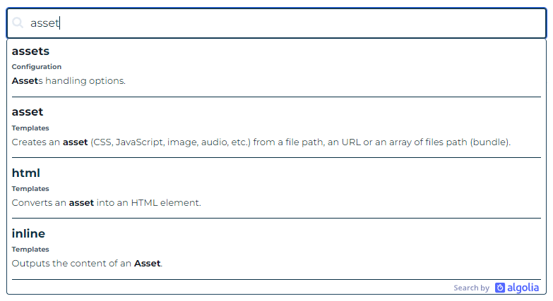
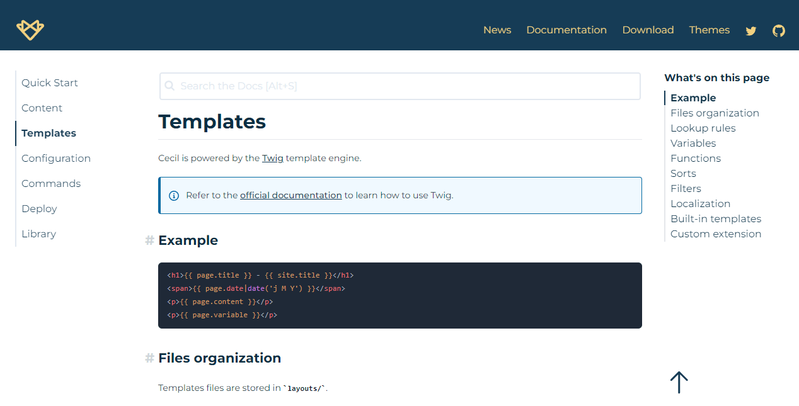
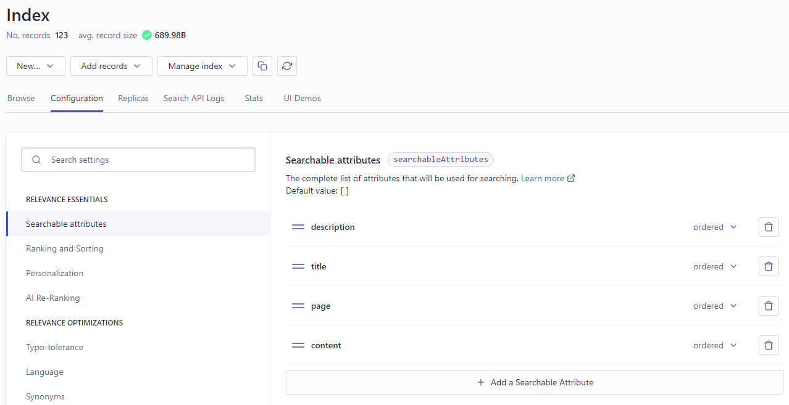

:::intro
Billet initialement publié sur le [blog d’Arnaud Ligny](https://arnaudligny.fr/blog/moteur-de-recherche-algolia-site-statique/).
:::

Quand je travaillais à enrichir la [documentation](https://cecil.app/documentation/) de [Cecil](https://cecil.app), je me suis dit qu’il serait pertinent d’offrir un moteur de recherche *[full text](https://fr.m.wikipedia.org/wiki/Recherche_plein_texte)* aux utilisateurs.

{loading=eager}
<!-- break -->

[toc]

La documentation de Cecil est composée de moins de 10 pages : une par thématique (configuration, gestion des contenus, création des templates, etc.) et chacune d’elle contient de nombreuses sections, accessibles par des ancres.

Aussi, il est important que les résultats retournés par un moteur de recherche soient granulaires, c’est à dire qu’ils ciblent ces sections au sein d’une page.



## Quelle solution technique ?

### Google CSE

Dans un premier temps j’ai expérimenté le [moteur de recherche personnalisé de Google](https://cse.google.com/) (CSE) qui permet de présenter les résultats indexés par Google pour un site donné (comme avec le préfixe `site:`).  
Si les résultats sont pertinents pour un site contenant de nombreuses pages, il ne semble pas possible de personnaliser les résultats en fonction de sections au sein d’une même page, ce qui ne correspondant pas à mon besoin.

*[CSE]: Custom Search Engine

### Algolia

Aussi, après plusieurs comparatifs, j’ai finalement retenu la solution [Algolia](https://www.algolia.com/) pour les raisons suivantes :

* Pertinence des résultats
* [Tarifs abordables](https://www.algolia.com/pricing/) (dont un plan gratuit)
* [Documentation riche](https://www.algolia.com/doc/)
* Nombreuses bibliothèques de code [open source](https://github.com/algolia)

## Étapes clefs

Je souhaitais que le champ de recherche soit disponible sur chacune des pages et qu’il montre immédiatement un extrait des résultats lors de la saisie d’un ou plusieurs mots clefs, et laissant le choix à l’utilisateur de sélectionner la section à consulter : j’ai donc opté pour l’approche [*Autocomplete*](https://www.algolia.com/doc/ui-libraries/autocomplete/introduction/what-is-autocomplete/) (cf. la capture d’écran en début de billet).

### Créer un index

Algolia s’appuie sur un [index](https://www.algolia.com/doc/guides/sending-and-managing-data/prepare-your-data/#algolia-index), c’est à dire une collection d’enregistrements dans laquelle la recherche va être effectuée et dont le résultat permet d’afficher un certain nombre d’informations et de pointer vers la page Web correspondante.

Cet index est une [structure JSON](https://www.algolia.com/doc/guides/sending-and-managing-data/prepare-your-data/#algolia-records) relativement libre, composée de couples clef-valeur, permettant d’avoir de la matière dans laquelle chercher et également ajuster les critères de recherche.

### Transmettre l’index

Algolia propose [plusieurs méthodes](https://www.algolia.com/doc/guides/sending-and-managing-data/send-and-update-your-data/) afin de transmettre ou de mettre à jour l’index :

- à la main, [via le dashboard](https://www.algolia.com/doc/guides/sending-and-managing-data/send-and-update-your-data/how-to/importing-from-the-dashboard/), en uploadant le fichier JSON
- en ligne de command, via [Algolia CLI](https://www.algolia.com/doc/tools/cli/get-started/overview/)
- programmatiquement, en [PHP](https://www.algolia.com/doc/api-client/getting-started/install/php/), en [JavaScript](https://www.algolia.com/doc/api-client/getting-started/install/javascript/), etc.

### Paramétrer l’index

Le paramétrage de l’index, c’est à dire déterminer les attributs dans lesquels rechercher, le classement et l’ordonnancement, etc. est relativement simple à réaliser depuis le [dashboard](https://algolia.com/dashboard).

Je dis *relativement* car il peut être nécessaire d’effectuer quelques tests avant de maitriser les règles de priorisation des résultats.



## Mise en œuvre

Dans le cas de la documentation de [Cecil](/tags/cecil), il faut donc :

1. créer un fichier d’index au format JSON
2. le transmettre à application Algolia
3. afficher un champs de recherche avec auto-complétion

### Création de l’index

Avec [Cecil](/tags/cecil) il est plutôt aisé de créer un fichier JSON puisque, par définition, c’est son job de générer des fichiers statiques 😊

Ainsi, l’objectif est de :

1. collecter le contenu des pages de la documentation (fichiers au format Markdown dans `pages/documentation`), converti en HTML
2. découper ce contenu de manière cohérente (l'objectif n’est pas de pointer sur la page, mais bien sur une section de la page), via un [template Twig](https://cecil.app/documentation/templates) sur mesure
3. générer un fichier `algolia.json` grâce aux [formats de sortie](https://cecil.app/documentation/configuration#formats)

#### Résultat cible

Le fichier d’index va ressembler à ça :

```json
[
  {
    "objectID": "documentation/quick-start#download-cecil",
    "page": "Quick Start",
    "title": "Download Cecil",
    "description": "Download cecil.phar from your terminal:",
    "content": "...",
    "date": "2020-12-19T00:00:00+00:00",
    "href": "documentation/quick-start/#download-cecil"
  },
  ...
]
```

#### Création du template

Comme indiqué précédemment, dans le contexte de Cecil, pour créer ce fichier il est nécessaire de créer un template Twig qui va collecter les donner et les rendre au format JSON.

S’agissant de rechercher dans la documentation, j’aurais pu créer ce template dans le dossier « documentation » (`layouts/documentation/list.algolia.twig`).  
Mais comme je souhaite potentiellement étendre la recherche à plusieurs types de contenus (tels que les « news ») je préfère créer un template applicable à l’ensemble des contenus du site, donc une liste par défaut : `layouts/_default/list.algolia.twig`.

Ainsi, au sein du template, il suffit de boucler sur les contenus de la section « documentation », à l’aide du tag `for` :

```twig

...

```

Ensuite, toute l’astuce consiste à « jouer » sur les header HTML, en l’occurence le « H3 » afin de découper le contenu d’une page en sous sections :

```twig

```

> Le filtre Twig [`preg_split`](https://cecil.app/documentation/templates/#preg-split) à été créé pour l’occasion afin de permettre le découpage d’une chaine de caractère en un tableau, selon une expression régulière.

De là, il suffit ensuite d’extraire les contenus cibles de chaque section, via de la manipulation de chaines de caractères, pour alimenter un « dataset » :

```json
{
  "objectID": "Un ID unique",
  "page": "Le nom de la page de documentation",
  "title": "Le titre de section",
  "description": "Le premier paragraphe de la section (utilisé pour illustrer l’aperçu des résiltats)",
  "content": "Le contenu de la section, dans laquelle la recherche est effectuée",
  "date": "La date de la page, utilisée pour pondérer les résultats",
  "href": "Le lien vers la page de la documentation, combinée à une ancre afin d’emmener l’internaute à la bonne section",
}
```

> Voir le [template complet sur GitHub](https://github.com/Cecilapp/website/blob/master/layouts/_default/list.algolia.twig).

#### Associer ce template à un format de sortie

En l’état, Cecil ne sait pas qu’il faut utiliser ce template et surtout à quel type de contenu il doit être associé. C’est embêtant 😅

Pour régler ce soucis il suffit de compléter la configuration de la manière suivante :

```yaml
output:
  formats:
    - name: algolia
      mediatype: 'application/json'
      filename: 'algolia'
      extension: 'json'
  pagetypeformats:
    homepage: ['html', 'atom', 'algolia']
```

Maintenant Cecil sait que :

1. Les pages dont la variable `format` a pour valeur le nom du format « algolia » peuvent utiliser un template de la forme `<layout>.algolia.twig`
2. Enregistrer le fichier généré sous `filename.extension`, soit « algolia.json »
3. La page de type `homepage` (listant toutes les pages du site) doit être générée dans le format « algolia » (en plus de « html » et « atom »)

Et voilà, l’index est maintenant généré et disponible à la racine du site généré : <https://cecil.app/algolia.json>.

### Transmission de l’index

Comme [indiqué précédemment](#transmettre-l-index), Algolia offre plusieurs méthodes d’envoi de l’index.

Dans un premier temps j’ai déposé manuellement le fichier généré localement directement depuis le dashboard : c’est un moyen simple et rapide de faire des tests d’intégrité de l’index.

J’ai ensuite cherché à automatisé cette procédure, et j’ai donc opté pour le client d’API JavaScript.  
[Cecil.app](https://cecil.app) étant hébergé par Netlify, j’ai utilisé un plugin pour me simplifier la mise en oeuvre : [*Algolia Index Refresh Build Plugin*](https://github.com/reima-ecom/netlify-plugin-refresh-algolia) :

```toml
[[context.production.plugins]]
  package = "netlify-plugin-refresh-algolia"
  [context.production.plugins.inputs]
    appId = "APP_ID"
    indexName = "INDEX"
    filePath = "_site/algolia.json"
```

#### Formulaire de recherche


La mise en œuvre est relativement simple :

1. intégrer un champ de saisi (élément `input`)
2. lui associer la bibliothèque _[Autocomplete.js](https://github.com/algolia/autocomplete/tree/v0)_

**Champ de saisie :**

```html
<input type="text" id="search-input" placeholder="Search the Docs [Alt+S]" accesskey="s" />
```

**_Autocomplete.js_ :**

```javascript
// client Algolia
var client = algoliasearch('APP_ID', 'API_KEY');
// index dans lequel rechercher
var index = client.initIndex('INDEX');
// fonction de recherche
function newHitsSource(index, params) {
  return function doSearch(query, cb) {
    index
      .search(query, params)
      .then(function(res) {
        cb(res.hits, res);
      })
      .catch(function(err) {
        console.error(err);
        cb([]);
      });
  };
}
// association de la lib au champ "search-input"
autocomplete('#search-input', { hint: false }, [
  {
    source: newHitsSource(index, {
      // paramètres de mise en valeur des résultats suggérés
      hitsPerPage: 4,
      attributesToHighlight: ['description', 'page', 'title'],
      highlightPreTag: '<strong>',
      highlightPostTag: '</strong>',
      attributesToSnippet: ['description:25'],
      snippetEllipsisText: '…'
    }),
    // clef d'affichage principale (ici le titre de la section)
    displayKey: 'title'
  }
]).on('autocomplete:selected', function(event, suggestion, dataset, context) {
  // au clic sur une suggestion on envoie l'internaute vers la page#ancre correspondante
  window.location.href = '{{ url() }}' + suggestion.href;
});
```

> Voir le [template complet sur GitHub](https://github.com/Cecilapp/website/blob/master/layouts/partials/search-box.html.twig).

Et voilà ! 🎉

**Notes :**

1. Il s’agit ici de la version 0 de _Autocomplete.js_ qui reste fonctionnelle mais commence à vieillir
2. La personnalisation de l’apparence des suggestions est un peu pénible car il faut arriver à « retrouver » les classes CSS générées à la volée via JavaScript, ce qui n’est pas toujours évident…

## Conclusion

Je me suis bien amusé à créer ce moteur de recherche, et je suis plutôt satisfait de la fonctionnalité, qui est fonctionnelle et surtout très utile.

Pour tester, ça se passe par ici : <https://cecil.app/documentation/>
